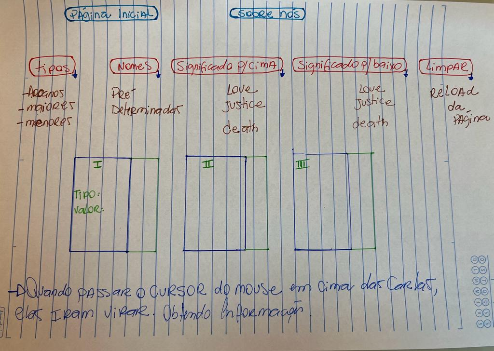

# Data Lovers

## * Resumo do projeto:

Neste projeto construimos três páginas web que se adequaram às necessidades dos usuários que permite visualizar os dados, filtrá-lós e ordená-los. Construimos as interfaces de acordo que o usuário interage e entenda.
Para a execução do projeto, fizemos cronogramas semanais de acordo com o andamento e necessidades ( baby steeps), começamos pelo protótipo de baixa fidelidade e depois para o de alta fidelidade no figma. Passamos para as primeiras páginas aplicando o html semântica e dando style no css, conforme iamos avançando tivemos a necessidade de fazer pesquisas, assistir videos, fazer cursos rápidos e tivemos apoio de colegas. Por fim aplicamos o javaScript e intercalando os testes unitários. Revisamos todo o projeto!

## * Histórias de usuário:

Como estudantes das cartas de Tarot, gostaria de um site de fácil acesso para pesquisar características especificas que possam me fugir da memória em algum momento como seus nomes ou ate mesmo seus significados . 

## * Definição do produto:
Os beneficiários do produto terão uma experiência de conhecer as cartas de Tarot, obtendo as informações de cada uma delas, que são 78 cartas no total, divididas entre Arcanos Maiores (22), Arcanos Menores (56), e os seus significados. 

## * Protótipo de baixa fidelidade

## * Protótipo de alta fidelidade

## * Link para o GitHub Pages
https://narabranco.github.io/SAP010-data-lovers/

***

## 9. Checklist

* [x] Usar VanillaJS.
* [x] Passa pelo linter (`npm run pretest`)
* [x] Passa pelos testes (`npm test`)
* [x] Testes unitários cobrem um mínimo de 70% de statements, functions, lines e
  branches.
* [x] Inclui uma _definição de produto_ clara e informativa no `README.md`.
* [x] Inclui histórias de usuário no `README.md`.
* [x] Inclui rascunho da solução (protótipo de baixa fidelidade) no `README.md`.
* [x] Inclui uma lista de problemas detectados nos testes de usabilidade no
  `README.md`.
* [x] UI: Mostra lista/tabela/etc com dados e/ou indicadores.
* [x] UI: Permite ordenar dados por um ou mais campos (asc e desc).
* [x] UI: Permite filtrar dados com base em uma condição.
* [x] UI: É _responsivo_.
